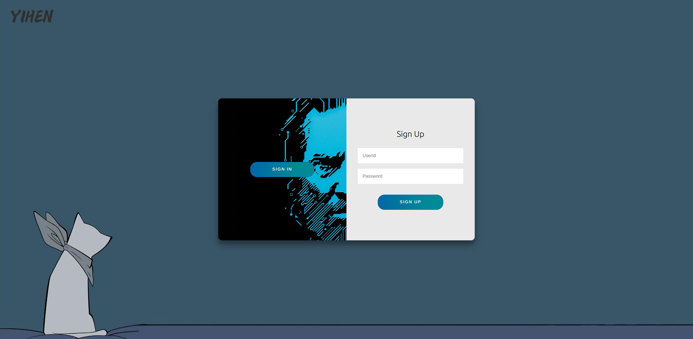
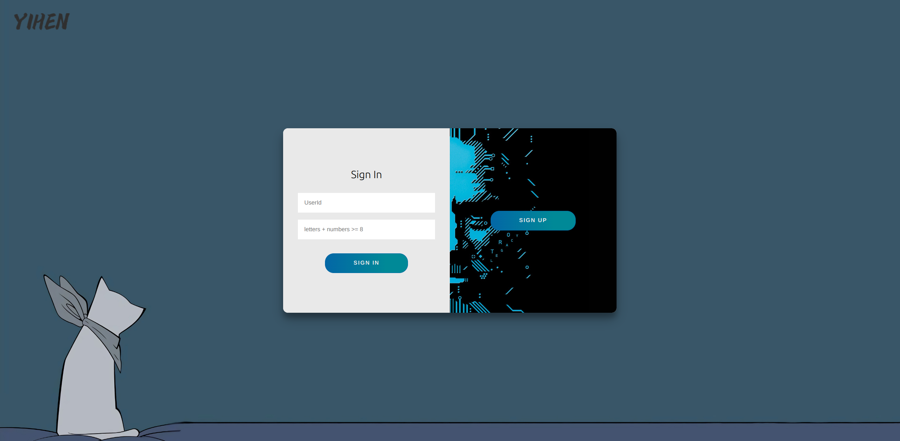
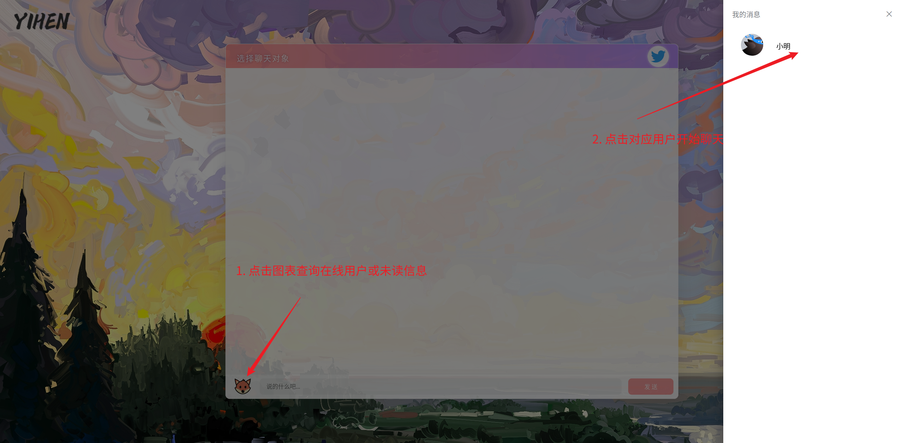
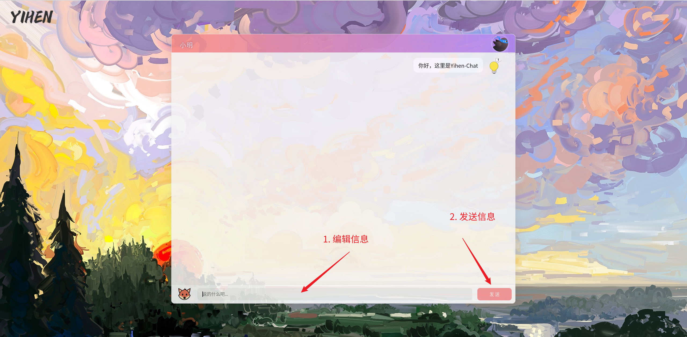
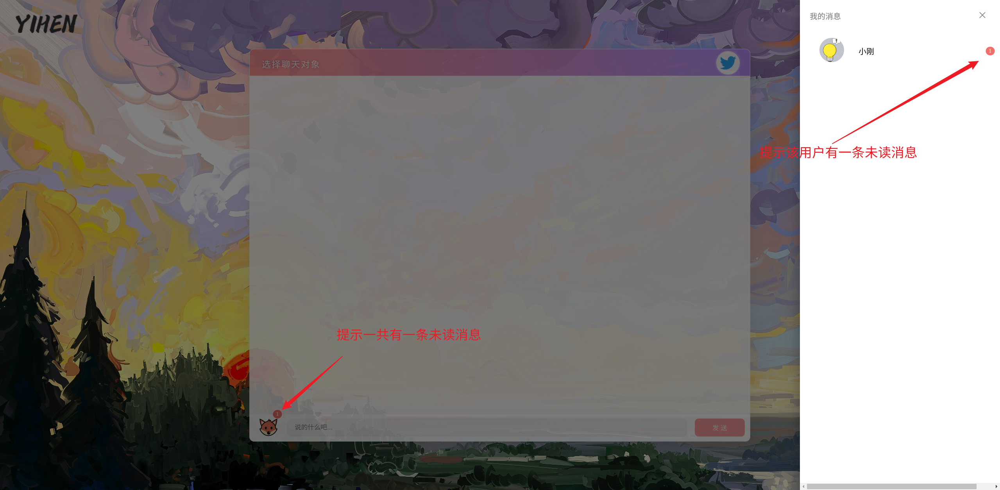
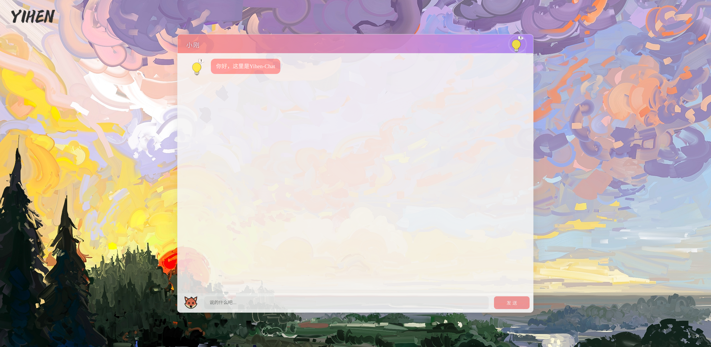

# Yihen-Chat

​		通过websocket实现的前后端分离单聊页面。项目基于SpringBoot构建，使用MyBatisPlus操作数据库，使用websocket实现通信

​		项目前端：ChatRoom

​		项目后端：Yihen-Chat

## 项目启动

1. 创建项目数据库表
   - 数据库表SQL脚本: `Yihen-Chat/tb_user.sql`
2. 修改配置文件（application.yml）中连接数据库部分
3. 登陆页面: http://127.0.0.1:5500/ChatRoom/pages/login.html (如果使用VsCode启动前端，具体端口根据打开前端页面的方式)
   - 用户ID: 1 ; 密码:  1234
   - 用户 ID: 2 ; 密码: 6666
   - 其余用户可以自己通过登陆页面注册（SIGN IN 按钮注册）

> 登陆页面

> 注册页面

4. 进入聊天页面，点击输入框左侧图表查询在线用户，点击用户开始聊天

5. 编辑信息，开始聊天

6. 当收到信息时，图表会提醒，点击找到对应发送消息的用户开始聊天

## 局限

​		聊天历史记录没有本地化存储，刷新后聊天记录清空